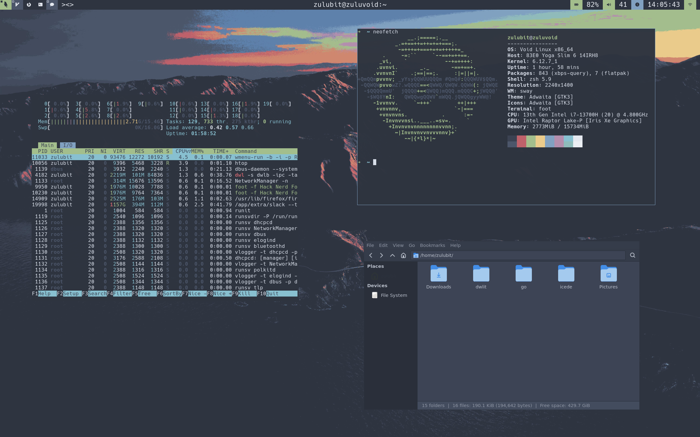
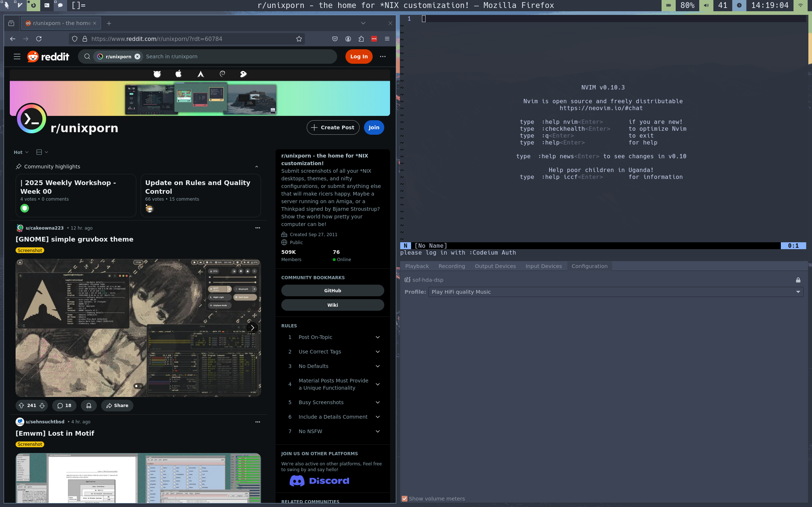

# DWLit - a fork of DWL with a lot of extras by zulubit





## Building:

A script is included that fires all the build commands:

If you havent already, clone the repository, install the dependencies and:

```bash
cd ~/dwlit
./rebuild.sh
```

whenever you change your **config.def.h** you should use the same script to rebuild.

if you decide to do changes to **config.h** directly you should just run

```bash
cd ~/dwlit
sudo make install clean
```

## Starting:

there is a script you should use to start dwlit

```bash
cd
./dwlit/start.sh
```

before you start you should make sure all the scripts in **./scripts** are executable

## Apply theme and fonts

There is a script provided to install the *Nord GTK theme* and *Hack Nerd Font* 

```bash
cd ~/dwlit
chmod +x installtheme.sh
./installtheme.sh
```

## Void (Linux) autoinstall

If you'd like to have a full minimal setup a script is provided.

**This script automatically does all the steps described above**

This sctipt should only ever be used on a fresh network install of *Void (Linux)*

The script will update the system.

You should install **openssl** and **git** packages,

```bash
git clone https://github.com/zulubit/dwlit.git
cd dwlit
chmod +x voidautoinstall.sh
sudo reboot
```

you'll probably be asked fo your users password a couple of times so pay some attention.

## Importand bindings:

- **logo + enter** - open terminal
- **logo + p** - open menu
- **logo + shift + Q** - kill focused

the rest shloud be looked up in **~/dwlit/config.def.h**. It's advisable to be familiar with the entire file.

## Misc:

To get a better flatpak experience you should probably install **Flatseal** from flathub and enable wayland support globally

To make use of the power button binding you should disable the default button behaviour in **logind.conf** bt setting "HandlePowerKey" to "ignore"

## Dependencies:

References copied from:

- [dwl](https://codeberg.org/dwl/dwl)
- [dwl bar (dwlb)](https://github.com/kolunmi/dwlb)
 
### Building dwl
### **dwl branch 0.7 and releases based upon 0.7 build against [wlroots] 0.18**

dwl has the following dependencies:
- libinput
- wayland
- wlroots (compiled with the libinput backend)
- xkbcommon
- wayland-protocols (compile-time only)
- pkg-config (compile-time only)

dwl has the following additional dependencies if XWayland support is enabled:
- libxcb
- libxcb-wm
- wlroots (compiled with X11 support)
- Xwayland (runtime only)

Install these (and their `-devel` versions if your distro has separate development packages)

### Full experience Dependencies

These dependencies are required by DWLit but are not already listed in the DWL dependencies. Many are optional groups and can be installed based on your needs.

#### Networking and Bluetooth
```bash
NetworkManager bluetuith curl
```

#### File Management and Thumbnails
```bash
Thunar tumbler gth
```

#### Multimedia
```bash
Mako vlc grim slurp swappy wf-recorder
```

#### System Utilities
```bash
base-devel base-system make gcc git curl wget elogind light
```

#### Wayland and Related
```bash
swaylock swaybg wl-clipboard wlroots-devel wlroots0.18 wlroots0.18-devel wlroots0.18-devel
```

#### Audio and Video
```bash
pipewire pulseaudio pamixer pavucontrol sof-firmware sof-tools
```

#### Fonts and XWayland Support
```bash
dejaVu-fonts-ttf xorg-server-xwayland qt5-wayland qt6-wayland
```

#### Other Tools and Libraries
```bash
polkit polkit-elogind lxsession xdg-desktop-portal-wlr xdg-desktop-portal-gtk fcft fcft-devel
```

Install these (and their `-devel` versions if your distro has separate development packages). The reference names of packages are from *Void (Linux)*, if you're using a different distro, these packages are surely available so make sure to look up their names if instaling referenced ones fails.
